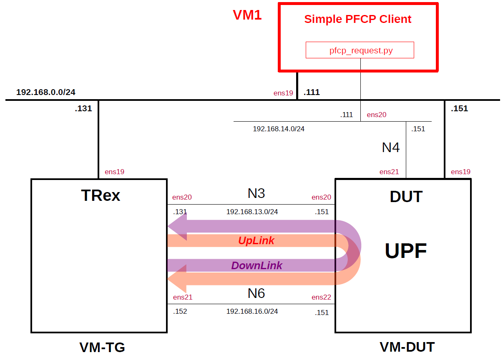

# Simple PFCP Client
This describes how to use a simple PFCP client to configure UPF.
This is intended as a preparation for measuring the performance of open source UPFs ([Open5GS UPF](https://github.com/open5gs/open5gs), [free5GC UPF](https://github.com/free5gc/go-upf), [UPG-VPP](https://github.com/travelping/upg-vpp) and [eUPF](https://github.com/edgecomllc/eupf)).

---

### [Sample Configurations and Miscellaneous for Mobile Network](https://github.com/s5uishida/sample_config_misc_for_mobile_network)

---

<a id="toc"></a>

## Table of Contents

- [Simple Overview of PFCP Client, TRex and DUT (UPF)](#overview)
- [Install Simple PFCP Client](#install)
  - [Install required packages](#install_packages)
  - [Setup venv](#setup_venv)
  - [Install Scapy](#install_scapy)
  - [Modify pfcp.py](#modify_pfcp)
  - [Install pfcp_request.py](#install_pfcp)
- [Set parameters in pfcp_request.py](#set_param)
- [Run pfcp_request.py](#run)
- [Sample Configurations](#sample_conf)
- [Changelog (summary)](#changelog)

---

<a id="overview"></a>

## Simple Overview of PFCP Client, TRex and DUT (UPF)

This describes a simple configuration of PFCP Client, TRex and DUT (UPF).
**Note that this configuration is implemented with Proxmox VE VMs.**

The following minimum configuration was set as a condition.
- One PFCP client, TRex and DUT (UPF)

The built simulation environment is as follows.

</img>

The PFCP client in Python was created using the following.
- Scapy v2.6.1 - https://github.com/secdev/scapy

Each VMs are as follows.  
| VM | SW & Role | IP address | OS | CPU | Mem | HDD |
| --- | --- | --- | --- | --- | --- | --- |
| VM1 | Simple PFCP Client | 192.168.0.111/24 | Ubuntu 24.04 | 1 | 1GB | 10GB |
| VM-TG | TRex<br>Traffic Generator | 192.168.0.131/24 | Ubuntu 24.04 | 3 | 8GB | 10GB |
| VM-DUT | each UPF DUT<br>(Device Under Test) | 192.168.0.151/24 | Ubuntu 24.04<br>or 22.04 | 2 | 8GB | 10GB |

The network interfaces of each VM are as follows.
| VM | Device | Model | Linux Bridge | IP address | Interface | Under<br>DPDK |
| --- | --- | --- | --- | --- | --- | --- |
| VM1 | ens18 | VirtIO | vmbr1 | 10.0.0.111/24 | (NAPT NW) | -- |
| | ens19 | VirtIO | mgbr0 | 192.168.0.111/24 | (Mgmt NW) | -- |
| | ens20 | VirtIO | vmbr4 | 192.168.14.111/24 | N4 | -- |
| VM-TG | ens18 | VirtIO | vmbr1 | 10.0.0.131/24 | (NAPT NW) | -- |
| | ens19 | VirtIO | mgbr0 | 192.168.0.131/24 | (Mgmt NW) | -- |
| | ens20 | VirtIO | vmbr3 | 192.168.13.131/24 | N3 | x |
| | ens21 | VirtIO | vmbr6 | 192.168.16.152/24 | N6 | x |
| VM-DUT | ~~ens18~~ | ~~VirtIO~~ | ~~vmbr1~~ | ~~10.0.0.151/24~~ | ~~(NAPT NW)~~ ***down*** | -- |
| | ens19 | VirtIO | mgbr0 | 192.168.0.151/24 | (Mgmt NW) | -- |
| | ens20 | VirtIO | vmbr3 | 192.168.13.151/24 | N3 | -- |
| | ens21 | VirtIO | vmbr4 | 192.168.14.151/24 | N4 | -- |
| | ens22 | VirtIO | vmbr6 | 192.168.16.151/24 | N6 | -- |

Linux Bridges of Proxmox VE are as follows.
| Linux Bridge | Network CIDR | Interface |
| --- | --- | --- |
| vmbr1 | 10.0.0.0/24 | NAPT NW |
| mgbr0 | 192.168.0.0/24 | Mgmt NW |
| vmbr3 | 192.168.13.0/24 | N3 |
| vmbr4 | 192.168.14.0/24 | N4 |
| vmbr6 | 192.168.16.0/24 | N6 |

UE IP address and TEID are as follows.
| UE IP address | UpLink TEID | DownLink TEID |
| --- | --- | --- |
| 10.45.0.2/24 | 0x00000001 | 0x00000002 |

<a id="install"></a>

## Install Simple PFCP Client

<a id="install_packages"></a>

### Install required packages

```
# apt install python3 python3-pip python3-venv
```

<a id="setup_venv"></a>

### Setup venv

Set venv to `~/venv`.
```
# mkdir ~/venv
# python3 -m venv ~/venv
```
**Note. From now on, when using Python, first type as follows.**
```
# source ~/venv/bin/activate
(venv) root@pfcp:~#
```

<a id="install_scapy"></a>

### Install Scapy

```
# source ~/venv/bin/activate
(venv) root@pfcp:~# pip3 install scapy
```

<a id="modify_pfcp"></a>

### Modify pfcp.py

According to `3GPP TS 29.244 - 8.2.118 3GPP Interface Type`, add interface types `SGi` and `N6` in `pfcp.py` as follows.

`~/venv/lib/python3.12/site-packages/scapy/contrib/pfcp.py`
```diff
--- pfcp.py.orig        2024-12-14 06:09:59.763278982 +0900
+++ pfcp.py     2024-12-17 22:00:09.601881929 +0900
@@ -363,6 +363,8 @@
     13: "N3 Untrusted Non-3GPP Access",
     14: "N3 for data forwarding",
     15: "N9",
+    16: "SGi",
+    17: "N6",
 }
 
 
```

<a id="install_pfcp"></a>

### Install pfcp_request.py

Get [pfcp_request.py](./src/pfcp_request.py) written in Python.
```
# wget https://github.com/s5uishida/simple_pfcp_client/raw/refs/heads/main/src/pfcp_request.py
```
Also, referring to [801room/upf_p4_poc/test_script/pfcp_request.py](https://github.com/801room/upf_p4_poc/blob/main/test_script/pfcp_request.py), I wrote this script to configure the open source UPFs - Open5GS UPF, free5GC UPF, UPG-VPP and eUPF.
If using UPF which requires QER in `PFCP Session Establishment Request`, please refer to [pfcp_request_qer.py](./src/pfcp_request_qer.py).

<a id="set_param"></a>

## Set parameters in pfcp_request.py

Set the following parameters written in [pfcp_request.py](./src/pfcp_request.py).

| Item | Value (my environment) |
| --- | --- |
| PFCP_CP_IP_V4 | "192.168.14.111" |
| PFCP_UP_IP_V4 | "192.168.14.151" |
| N3_IP_V4 | "192.168.13.151" |
| GNB_IP_V4 | "192.168.13.131" |
| UE_IP_V4 | "10.45.0.2" |
| NWI | "internet" |
| APN_DNN | "internet" |
| PFCP_CP_IFACE | "ens20" |
| UL_TEID | 1 |
| DL_TEID | 2 |
| COUNTER | 100 |

If using [pfcp_request_qer.py](./src/pfcp_request_qer.py), please set the following additional parameters. The unit is Kbps.

| Item | Value (my environment) |
| --- | --- |
| UL_MBR | 200000000 |
| DL_MBR | 200000000 |
| UL_GBR | 200000000 |
| DL_GBR | 200000000 |

<a id="run"></a>

## Run pfcp_request.py

First start UPF. Then, to configure UPF, run `pfcp_request.py` as follows.
```
# source ~/venv/bin/activate
(venv) root@pfcp:~# python3 pfcp_request.py 
2025-02-11 12:02:03,765 - __main__ - INFO - REQ: <PFCPAssociationSetupRequest  IE_list=[<IE_NodeId  id_type=IPv4 ipv4=192.168.14.111 |>, <IE_RecoveryTimeStamp  timestamp=3948264123 |>, <IE_CPFunctionFeatures  |>] |>
.
Sent 1 packets.
2025-02-11 12:02:03,783 - __main__ - INFO - REQ: <PFCPSessionEstablishmentRequest  IE_list=[<IE_NodeId  id_type=IPv4 ipv4=192.168.14.111 |>, <IE_FSEID  v4=1 seid=0x8ca71035e5154265 ipv4=192.168.14.111 |>, <IE_CreatePDR  IE_list=[<IE_PDR_Id  id=1 |>, <IE_Precedence  precedence=65535 |>, <IE_PDI  IE_list=[<IE_SourceInterface  interface=Core |>, <IE_NetworkInstance  instance=b'internet' |>, <IE_UE_IP_Address  SD=1 V4=1 ipv4=10.45.0.2 |>, <IE_3GPP_InterfaceType  interface_type=N6 |>] |>, <IE_FAR_Id  id=1 |>] |>, <IE_CreatePDR  IE_list=[<IE_PDR_Id  id=2 |>, <IE_Precedence  precedence=65535 |>, <IE_PDI  IE_list=[<IE_SourceInterface  interface=Access |>, <IE_FTEID  V4=1 TEID=0x1 ipv4=192.168.13.151 |>, <IE_NetworkInstance  instance=b'internet' |>, <IE_SDF_Filter  FD=1 flow_description=b'permit out ip from any to assigned' |>, <IE_QFI  QFI=1 |>, <IE_3GPP_InterfaceType  interface_type=N3 3GPP Access |>] |>, <IE_FAR_Id  id=2 |>, <IE_OuterHeaderRemoval  |>] |>, <IE_CreateFAR  IE_list=[<IE_FAR_Id  id=1 |>, <IE_ApplyAction  FORW=1 |>, <IE_ForwardingParameters  IE_list=[<IE_DestinationInterface  interface=Access |>, <IE_NetworkInstance  instance=b'internet' |>, <IE_OuterHeaderCreation  GTPUUDPIPV4=1 TEID=0x2 ipv4=192.168.13.131 |>, <IE_3GPP_InterfaceType  interface_type=N3 3GPP Access |>] |>] |>, <IE_CreateFAR  IE_list=[<IE_FAR_Id  id=2 |>, <IE_ApplyAction  FORW=1 |>, <IE_ForwardingParameters  IE_list=[<IE_DestinationInterface  interface=Core |>, <IE_NetworkInstance  instance=b'internet' |>, <IE_3GPP_InterfaceType  interface_type=N6 |>] |>] |>, <IE_PDNType  pdn_type=IPv6 |>, <IE_APN_DNN  apn_dnn=b'internet' |>] |>
.
Sent 1 packets.
2025-02-11 12:02:08,783 - __main__ - INFO - REQ: 1
2025-02-11 12:02:08,784 - __main__ - INFO - REQ: <PFCPHeartbeatResponse  IE_list=[<IE_RecoveryTimeStamp  timestamp=3948264123 |>] |>
.
Sent 1 packets.
...
```
Now that the UPF is ready, you may measure its performance with TRex.
The maximum number of times in which `PFCP Heartbeat Response` can be sent to UPF is the value of the `COUNTER` parameter.
Please change the value as necessary.

---

I would like to thank the excellent developers and all the contributors of Scapy and [801room/upf_p4_poc/test_script/pfcp_request.py](https://github.com/801room/upf_p4_poc/blob/main/test_script/pfcp_request.py).

<a id="sample_conf"></a>

## Sample Configurations

- [Install TRex](https://github.com/s5uishida/install_trex)
- [Simple Measurement of UPF Performance 6](https://github.com/s5uishida/simple_measurement_of_upf_performance_6)
- [Simple Measurement of UPF Performance 9](https://github.com/s5uishida/simple_measurement_of_upf_performance_9)

<a id="changelog"></a>

## Changelog (summary)

- [2025.01.25] Added the description of the case when using UPF which requires QER in PFCP Session Establishment Request.
- [2025.01.16] Initial release.
